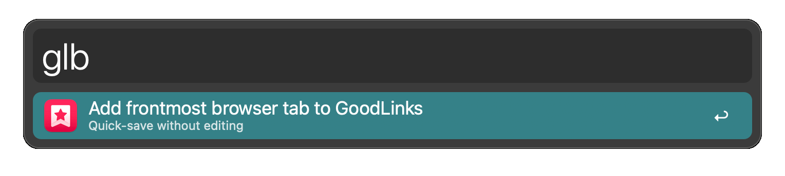
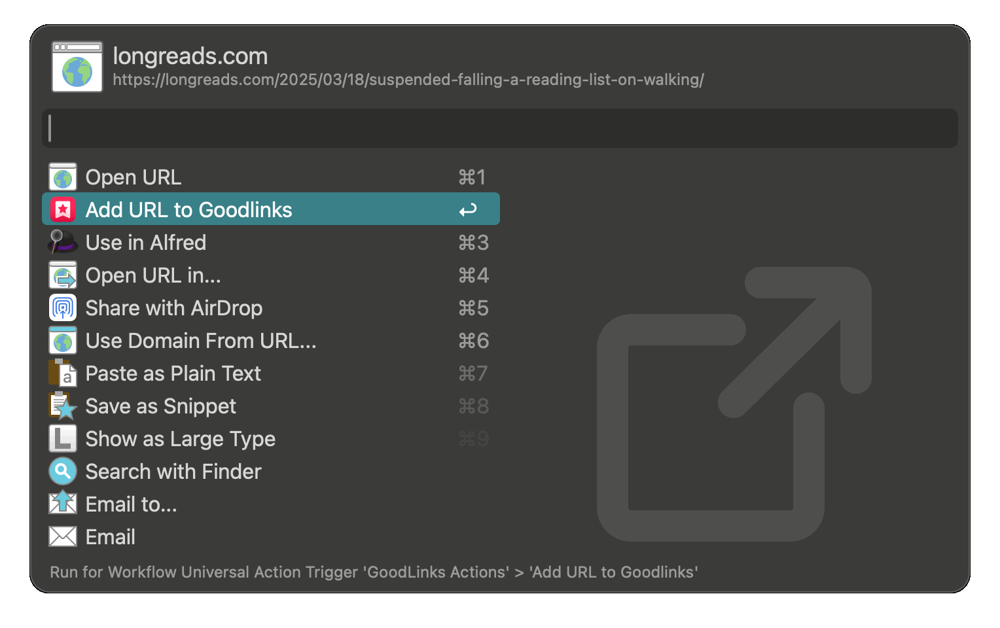
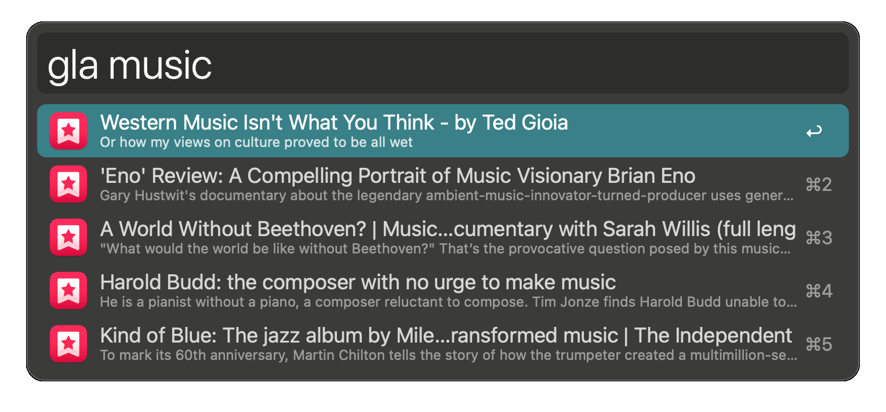
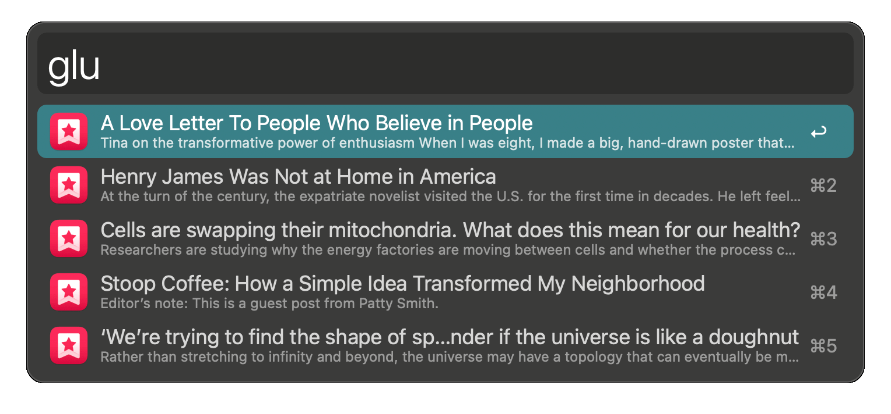
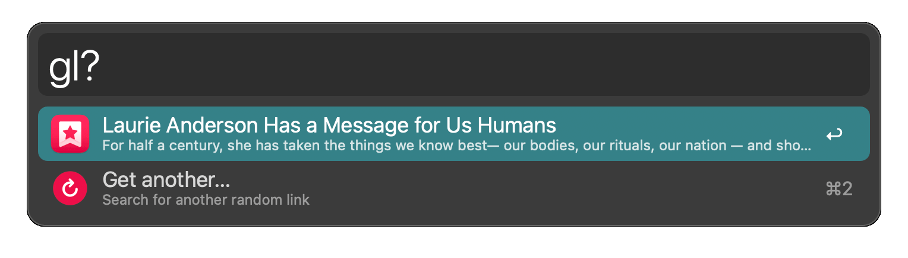
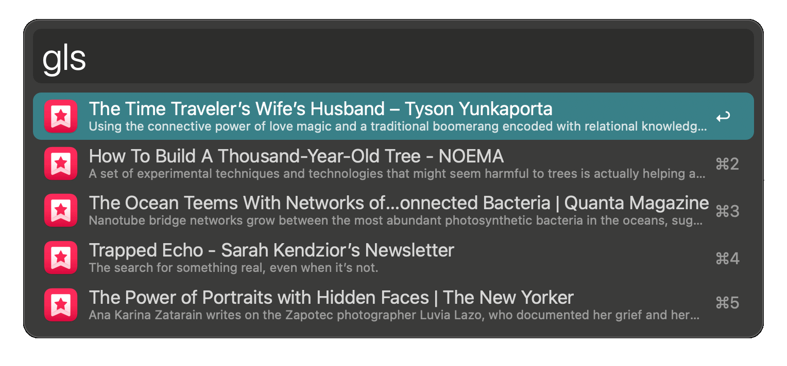
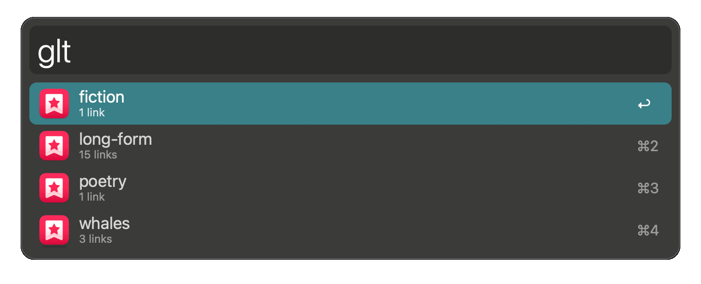
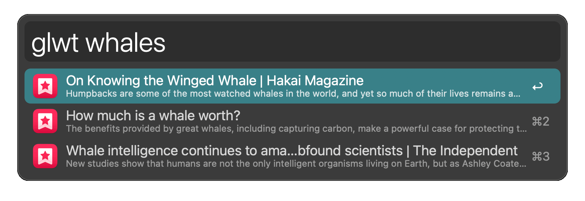
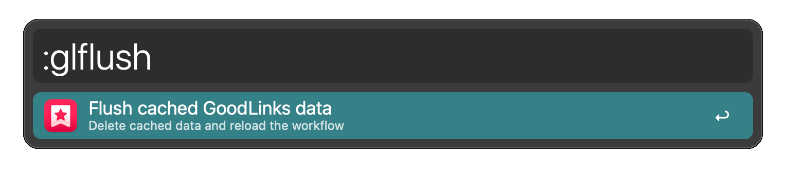

# GoodLinks Actions - Alfred workflow

[Alfred forum thread](https://www.alfredforum.com/topic/23148-goodlinks-actions/)

## Usage

Add and search for links in [GoodLinks](https://goodlinks.app).

### Add URL to GoodLinks

Add the URL of the frontmost browser's active tab to GoodLinks via the `glb` keyword.

Add any link to GoodLinks via the [Universal Action](https://www.alfredapp.com/help/features/universal-actions/).

#### Add URL Modifier Keys
- <kbd>↩︎</kbd> Add URL to GoodLinks
- <kbd>⌥</kbd><kbd>↩︎</kbd> Add URL and edit info (tags, etc.) in GoodLinks

### Search GoodLinks

Search all links via the `gla` keyword.

Search unread links via the `glu` keyword.

Search for a random unread link via the `gl?` keyword, with the option to search again.

Search starred links via the `gls` keyword.

Search for a tag via the `glt` keyword.

To get links with a specific tag, action the result, or enter a tag name via the `glwt` keyword.

#### Search Modifier Keys

- <kbd>↩︎</kbd> Open the link in GoodLinks
- <kbd>⌥</kbd><kbd>↩︎</kbd> Copy the link to the clipboard.
- <kbd>⌘</kbd> View the link's starred status,read/unread status, and tags, if any. (These defaults can be switched in the workflow configuration.)
- <kbd>⌃</kbd> Show the link's URL
- <kbd>⌘</kbd><kbd>L</kbd> Use Alfred's [Large Type](https://www.alfredapp.com/help/features/large-type/) feature to show a large-type view of the link's title, and if available, summary.

### Cached Workflow Data

Delete the workflow's caches via the `:glflush` keyword.

Afterwards, adding a URL or invoking a search will rebuild the cache with updated data from GoodLinks.

By default, the workflow caches GoodLinks data for 3600 seconds (1 hour), using a combination of Alfred's built-in script-filter cacheing and a cache file. The caches are rebuilt any time a URL is added via this workflow, or when initiating a search on an expired cache.

## Configuration

The workflow provides configuration for default search subtext, keywords, and cache duration.
